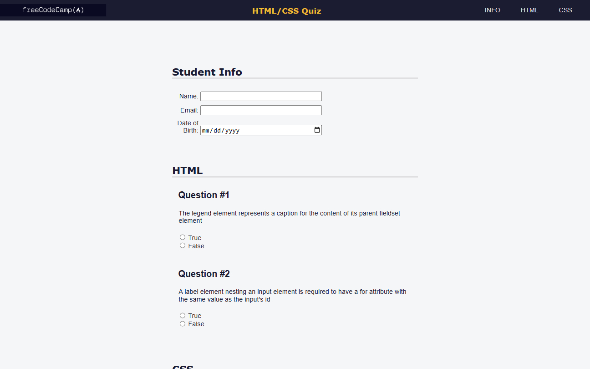

# Quiz | FCC Responsive Web Design Certification

**Project 9/20**

A responsive and accessible HTML/CSS quiz form 📝 built as part of the freeCodeCamp Responsive Web Design Certification. This project focuses on structuring content with semantic HTML, using accessibility attributes, and designing a user-friendly form layout. Fully responsive and keyboard-navigable ✅.

---

## 📚 Table of Contents

- [🔎 Overview](#-overview)
  - [📸 Screenshot](#-screenshot)
  - [🔗 Links](#-links)
  - [📌 Features](#-features)
- [🧠 My process](#-my-process)
  - [🛠️ Built with](#️-built-with)
  - [🎓 What I learned](#-what-i-learned)
  - [🔙 Previous Project](#-previous-project)
  - [🔜 Next Project](#-next-project)
- [👤 Author](#-author)
  - [🌐 Connect with Me](#-connect-with-me)
  - [💻 Coding Profiles](#-coding-profiles)

---

## 🔎 Overview

### 📸 Screenshot

### 🔗 Links

 - [🔴 Live Demo](https://dalascript.github.io/quiz/)
 - [🗂️ GitHub Repository](https://github.com/DalaScript/quiz)

### 📌 Features

 - ✅ Semantic HTML with proper headings, labels, and sections
 - ✅ Accessible design using `aria` attributes and `role="region"`
 - ✅ Visually hidden text for screen readers (`.sr-only`)
 - ✅ Responsive navigation and layout
 - ✅ Form elements with validation and structure

## 🧠 My Process

### 🛠️ Built with

 - HTML5
 - CSS3
 - Accessibility features

### 🎓 What I Learned

 - How to create accessible forms using ARIA roles and proper labels
 - Best practices for semantic HTML structure
 - Styling forms and inputs for better UX
 - Using visually hidden content for screen readers
 - Building responsive layouts with fixed headers and flexible content

  > 🚀 For me, this project was more about **practice** and gaining additional **experience**,  
  > rather than learning something entirely new.  
  >  
  > 👨‍💻 Since I’m not a beginner and already familiar with these technologies,  
  > I approached it with confidence — and still, I truly **enjoyed working on it**.  
  >  
  > 🎯 Overall, I consider this a very **valuable and enjoyable experience**.

### 🔙 Previous Project

 - Nutrition Label | *[Project 8/20]* → [View Repository](https://github.com/DalaScript/nutrition-label)

### 🔜 Next Project

 - Tribute Page *(Certification Project)* | *[Project 10/20]* → [View Repository](https://github.com/DalaScript/tribute-page)

---

## 👤 Author

### 🌐 Connect with Me

 - [Instagram](https://www.instagram.com/DalaScript)
 - [YouTube](https://www.youtube.com/@DalaScript)

### 💻 Coding Profiles

 - [freeCodeCamp](https://www.freecodecamp.org/DalaScript)
 - [FrontendMentor](https://www.frontendmentor.io/profile/DalaScript)
 - [GitHub](https://github.com/DalaScript)

*🙌 Thanks for checking out my project! More coming soon. Stay tuned 🚀*